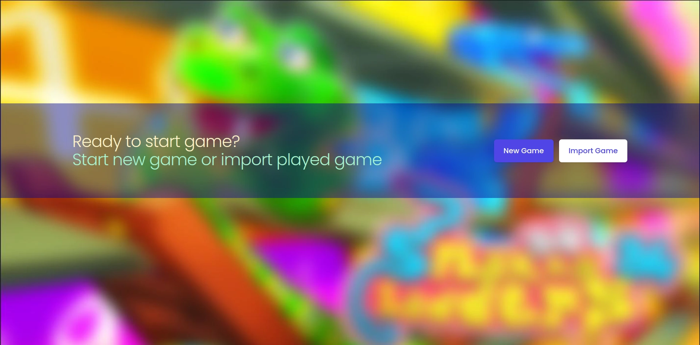
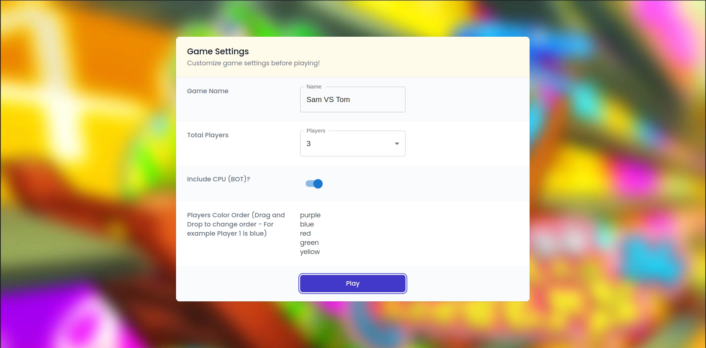

# 🐍🪜 &middot; [Snakes Ladders React](https://mohammadnedaei.github.io/Snakes-Ladders-React/) &middot;

## 🔎 Overview

Snakes and Ladders is a simple game created with `React` and `Typescript`.
Feel free to play it up to 5-player match. It also includes `BOT` player to increase interaction.

### This game looks like this:

#### Screenshots may change in the future because of UI/UX changes.

### 🎮 Gmaeplay:

https://user-images.githubusercontent.com/61457864/229280028-3d18240f-5f1d-4852-b6ac-0a790ef6c905.mp4

### 👑 Winning:

https://user-images.githubusercontent.com/61457864/229287084-8c778b29-e631-4547-9d99-d1c783273127.mp4
